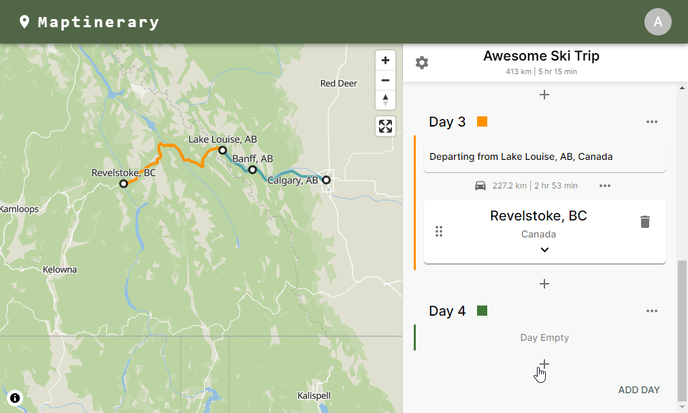

<h1> Maptinerary </h1>

A platform for planning, visualizing, and sharing your travels.

 

 

## Demo
[Check out the demo (V0.1)](https://maptinerary.app)

## Current Features
### v0.1 (latest release)
* Map Creator
  * Stops -
    * Users can create complex multi-day itinerary maps for trips with 50+ stops
    * Users can rearrange (drag and drop), add, and delete stops as they plan their journey as long as there is a navigable route between the associated itinerary stops
    * When expanded stops display available information about the stop, such as coordinates, address, details, a photo, and a link to the wikipedia article if found
  * Days
    * Users can further organize the timeline of their trip by adding additional days to their trip
    * Users can utilize the color coding feature to visualize which stops belong to each day
    * Day colors for the color coded days can be customized the users preference
  * Routes
    * Routes can be either vehicle navigation or flight paths
    * Route distance and estimated travel time is calculated and displayed
  * Map
    * Users can see the continuously updated itinerary route and stops displayed on the vector map
    * Users can click on stops to see a popup containing stop information
    * Users can click on routes displayed on the map as well as day titles on the itinerary to zoom to a focused day view on the map
    * Once in day view users can quickly navigate between days and analyze the stops and travel details for that day
* User Itineraries
  * User can view all their itineraries
  * User can open, edit info, delete, or create new itineraries
* Accounts
  * Registration
  * Login
  * Authentication and authorization in both front end and back end
  * Account recovery
  * Account settings (change password or email)
  * Preferences (country, timezone, metric/imperial)

## Future Features
### v0.2 (in development)
* Stops
  * Redesign of searching for and adding locations to new stops (see Location Search)
  * Will allow users to add millions of places and destinations from Yelp by integrating the Yelp Fusion API
  * New design on the cards for stops to allow for display of Yelp business based stops
* Location Search
  * New location search component will allow users to enter a search mode for an empty itinerary item/stop
  * When adding a new location the results from the location search will be displayed on the map and automatically zoomed to
  * User can hover over results to highlight map pin for each result
  * Users will be able to to automatically pan between current itinerary and search results
  * Service for caching Yelp Fusion API requests as well as protecting the API key
* Map
  * Change map style between several options, such as a dark theme map, default map, and topographical terrain map
  * Ability to zoom to fit entire route and individual stops, similar to the zoom to fit day feature when clicking on route or day title
* Other
  * Site dark theme (will automatically use system theme unless changed in user preferences)

### v0.3
* Location Search 
  * Airport search
    *  Users will be able to search thousands of commercial airports 
    *  The plan is to create an elasticsearch service that allows the user to search by geographic location, name, or IATA code
* Routes
  * Currently it is up to the user to decide which travel mode is used (Driving or Flight), the plan is to have routes change to a flight only when airports are consecutive stops in the itinerary
  * Add the option for users to remove routing from individual stops

### v0.4
* Share itineraries & explore community made itineraries
* Custom animations / follow along route animations

## Tech

### Frontend
The frontend application is a React app that uses Redux Toolkit for state management. Material UI is the UI framework and React Beautiful Drag and Drop is utilized for the drag and drop functionality on the itinerary.

    
  
  

### Backend

The backend is a serverless application built with the Serverless Framework and deployed on AWS. 

    
    
    
    

